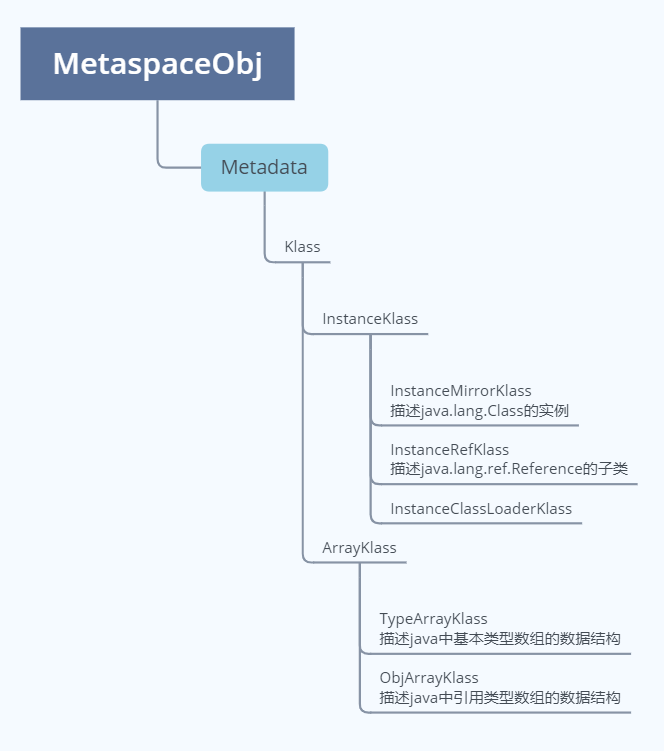
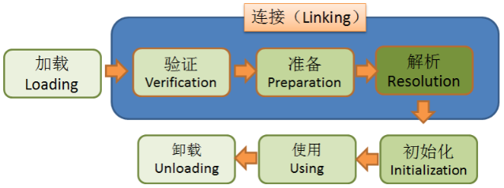

# 第1节：jvm前置知识
>我是jz，从业两年谈过需求，做过设计，组织过系统重构，执着于底层实现，立志做一个造轮子的开发。

## 一、前言
`多思，多想，多学，多做`

作为一个java程序员，一定或多或少对jvm有一定的了解，那大家有没有想过jvm是怎么实现的呢？

在我看来 jvm是一个字节码解释器，他屏蔽了系统细节，使得java程序具有一次编译，到处执行的特性。

jvm主要可以分为5块： 1.类加载子系统 2.内存模型 3.执行引擎 4.垃圾收集器 5.JIT热点代码缓存

## 二、Klass模型

Klass模型就是java模型在jvm中的存在形式,也就是c++中的类

在klass模型中分为 InstanceKlass 和 ArrayKlass

InstanceKlass(非数组):

    1. instanceKlass：普通类在jvm中对应的c++类，方法区 
    2. InstanceMirrorKlass 对应的Class对象 堆区

ArrayKlass
    
    1.TypeArrayKlass 基本数据类型数组
    2.ObjArrayClass  引用类型数组

## 三、类加载

类加载过程分为5个阶段：

1.加载

    通过类的全限定名获取存储该类的class文件
    解析成运行时数据，即instanceKlass,存放在方法区
    在堆区生成该类的class对象，即instanceMirrorKlass实例

2.验证 

    文件格式验证，元数据验证，字节码验证，符号引用验证

3.准备

    准备阶段为静态属性赋初值，如果被final修饰会给属性添加ConstantValue属性，直接赋值

4.解析
        
    将常量池中的符号引用转为直接引用
    符号引用：静态常量池索引
    直接引用：内存地址

5.初始化

    执行静态代码块，静态变量赋值（clinit方法）,如果没有不会生成，如果final修饰，不会在clinit中体现，一个字节码文件只有一个clinit方法

    

