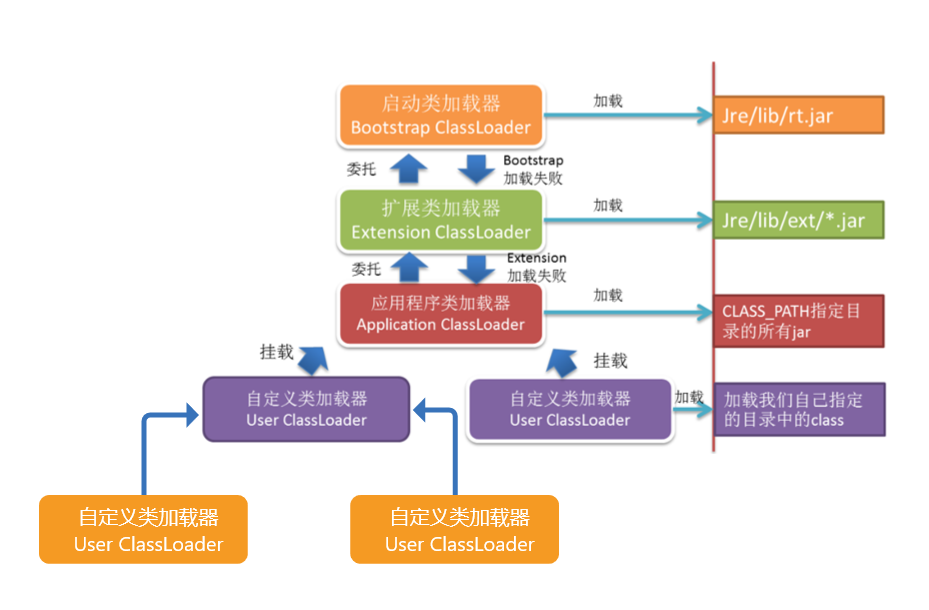
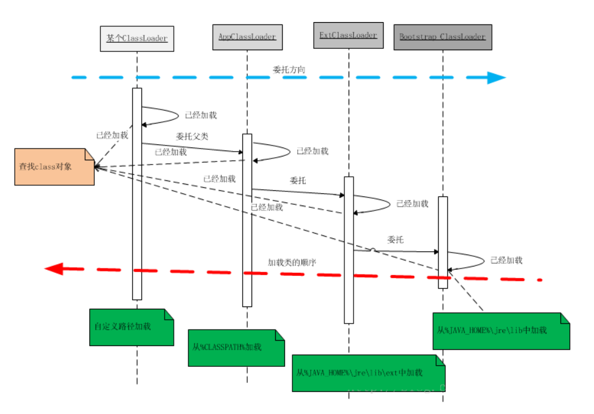
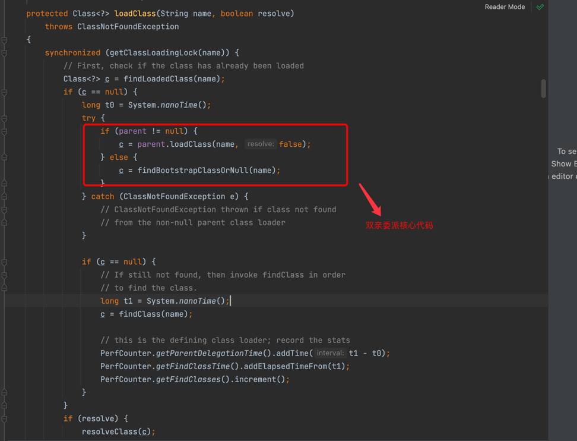

# 第2节：类加载器，双亲委派、SPI

> 我是jz，从业两年谈过需求，做过设计，组织过系统重构，执着于底层实现，立志做一个造轮子的开发。

## 一、前言

上一章我们介绍了JVM的主要构成，klass模型，以及类的加载。那这次我们就从类加载子系统开始

## 二、类加载器子系统

类加载器子系统 = 三层类加载器 + 双亲委派

JVM中有两种类型的类加载器：一种是c++编写的 BootstrapClassLoader，其他的是由Java编写的类加载器，继承于java.lang.ClassLoader



### 启动类加载器(BootstrapClassLoader)

启动类加载是由c++编写的，通过java查看显示为null，因此无法被java程序调用

启动类加载器不像其他类加载器有实体，它是没有实体的，JVM将C++处理类加载的一套逻辑定义为启动类加载器

``
查看启动类加载器加载路径 URL[] urLs = Launcher.getBootstrapClassPath().getURLs(); for (URL urL : urLs) { System.out.println(urL); } 可以通过 -Xbootclasspath指定
``

### 拓展类加载器

``
ClassLoader classLoader = ClassLoader.getSystemClassLoader().getParent(); URLClassLoader urlClassLoader = (URLClassLoader) classLoader; URL[] urls = urlClassLoader.getURLs(); for (URL url : urls) { System.out.println(url); } 可以通过java.ext.dirs指定
``

### 应用类加载器

默认加载用户程序的类加载器
``
String[] urls = System.getProperty("java.class.path").split(":"); for (String url : urls) { System.out.println(url); } System.out.println("================================"); URLClassLoader classLoader = (URLClassLoader) ClassLoader.getSystemClassLoader(); URL[] urls1 = classLoader.getURLs(); for (URL url : urls1) { System.out.println(url); } 可以通过java.class.path指定
``

### 自定义类加载器

```java
package com.test;

import java.io.ByteArrayOutputStream;
import java.io.File;
import java.io.FileInputStream;
import java.io.InputStream;

/**
 * @Description
 * @Author MeiZhiHao
 * @Date 2022-03-15 11:59 PM
 */
public class ClassLoder_1 extends ClassLoader {

    public static void main(String[] args) throws ClassNotFoundException {
        ClassLoder_1 classloader1 = new ClassLoder_1();
        classloader1.setFilepath("/Users/meizhihao/project/jvm-study/target/classes/");
        Class<?> clazz1 = classloader1.loadClass("com.cq.jvm.example.HelloWorld");
        System.out.println(clazz1.getClassLoader());

    }

    public static final String SUFFIX = ".class";

    public String filepath = "";

    public ClassLoder_1() {
        super();
    }

    public void setFilepath(String filepath) {
        this.filepath = filepath;
    }

    @Override
    protected Class<?> findClass(String className) throws ClassNotFoundException {
        byte[] data = getData(className.replace('.', '/'));

        return defineClass(className, data, 0, data.length);
    }

    private byte[] getData(String name) {
        InputStream inputStream = null;
        ByteArrayOutputStream outputStream = null;

        File file = new File(filepath + name + SUFFIX);

        System.out.println(filepath + name + SUFFIX);

        if (!file.exists()) return null;

        try {
            inputStream = new FileInputStream(file);
            outputStream = new ByteArrayOutputStream();

            int size = 0;
            byte[] buffer = new byte[1024];

            while ((size = inputStream.read(buffer)) != -1) {
                outputStream.write(buffer, 0, size);
            }

            return outputStream.toByteArray();
        } catch (Exception e) {
            e.printStackTrace();
        } finally {
            try {
                inputStream.close();
                outputStream.close();
            } catch (Exception ex) {
                ex.printStackTrace();
            }
        }

        return null;
    }
}
```

## 三、双亲委派机制

什么是双亲委派呢？当一个类加载器收到了加载某个类的请求,则该类加载器并不会去加载该类,而是把这个请求委派给父类加载器,每一个层次的类加载器都是如此,因此所有的类加载请求最终都会传送到顶端的启动类加载器;只有当父类加载器在其搜索范围内无法找到所需的类,并将该结果反馈给子类加载器,子类加载器会尝试去自己加载。



证明双亲委派机制

```java
package com.test;

/**
 * @Description
 * @Author MeiZhiHao
 * @Date 2022-03-16 12:11 AM
 */
public class ClassLoader_2 extends ClassLoader {

    /**
     *  null   
     *  按照逻辑 我定义了一个类加载器 去加载String类
     *  clazz.getClassLoader()结果应该是 ClassLoader_2 
     *  但是 返回的结果确实null (BootstrapClassLoader c++级别，无法回去到)
     */
    public static void main(String[] args) throws ClassNotFoundException {
        ClassLoader_2 classloader = new ClassLoader_2();
        Class<?> clazz = classloader.loadClass(String.class.getName());
        System.out.println(clazz.getClassLoader());
    }
}

```

为什么要有双亲委派机制呢？以为JVM中有一个沙箱安全机制比如我定义了一个类名为String所在包为java.lang，因为这个类本来是属于jdk的，如果没有沙箱安全机制的话，这个类将会污染到我所有的String,但是由于沙箱安全机制，所以就委托顶层的bootstrap加载器查找这个类，如果没有的话就委托ext,ext没有就到appclassloader，但是由于String就是jdk的源代码，所以在bootstrap那里就加载到了，先找到先使用，所以就使用bootstrap里面的String,后面的一概不能使用，这就保证了不被恶意代码污染

### 如何打破双亲委派

方法一：重写loadClass()方法

在jdk源码ClassLoad中



这个方法可以指定通过什么加载器进行加载，所以改写了它的默认规则，手动指定类加载器，也就实现了打破双亲委派

方法二：SPI机制

全称为 Service Provider Interface，是一种服务发现机制。它通过在ClassPath路径下的META-INF/services文件夹查找文件，自动加载文件里所定义的类。


