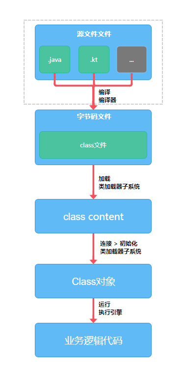
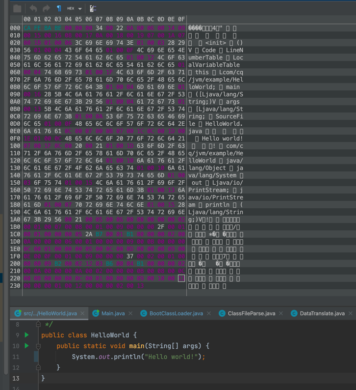
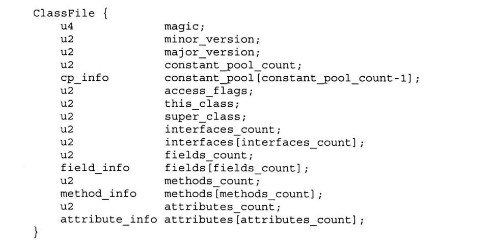
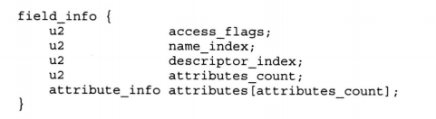
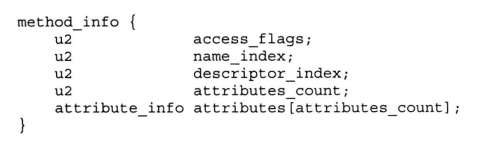

# 第3节：使用java实现，字节码解释器

> 我是jz，从业两年谈过需求，做过设计，组织过系统重构，执着于底层实现，立志做一个造轮子的开发。

## 一、前言
`多思，多想，多学，多做`

前两节介绍了类加载子系统，那有没有小伙伴知道一个.java文件是如何加载到jvm中让类加载器加载它呢？又是如何支持除java以外的其他语言呢？

jvm会将源文件编译为字节码文件.class然后通过类加载子系统加载到jvm中

那么本节的目标就是手写一个字节码解释器

## 二、手写字节码解释器

要实现字节码解释器，就应该知道字节码中有些什么

上图是HelloWorld经过编译后的字节码(使用BinEd插件)

### 字节码中有什么

让我们一个一个来解析这个字节码

magic:魔数,固定值 0xCA FE BA BE,唯一作用是确定这个文件是否为虚拟机接受的class文件，4字节,

minor_version、major_version:副版本号、主版本号 校验版本 2字节 2字节

constant_pool_count:常量池计数器 表示有多少个常量池 u2

constant_pool:常量池 

access_flags: 访问标志，用来表示类访问权限 u2

this_class : 常量池中某一项的索引值，CONSTANT_CLASS_INFO类型结构体 u2

super_class : 父类索引 0或者常量池中 对应CONSTANT_CLASS_INFO类型结构体的索引，指向继承的父类 u2

interfaces_count: 接口计数器，记录实现多少接口 u2

interfaces[] : 实现接口，每个interfaces[i]指向常量池有效索引占 u2

fields_count : 字段计数器 u2

field_info : 字段表

method_count : 方法计数器 u2

method_info : 方法表

attributes_count : 属性计数器

attribute_info : 属性表

分析完Class结构之后，那我们就可以开始解析class文件了

实现思路

1.使用io读取到class文件

    ``byte[] content = FileUtil.readBytes(new File(filePath));``

2. 定义 InstanceKlass模型、fieldInfo 模型、attributeInfo模型、methodInfo模型

3. 按照字节解析

详细代码: https://gitee.com/jz_zzh/jvm-study.git   com.cq.jvm.hotsport.src.share.vm.classfile.ClassFileParse

