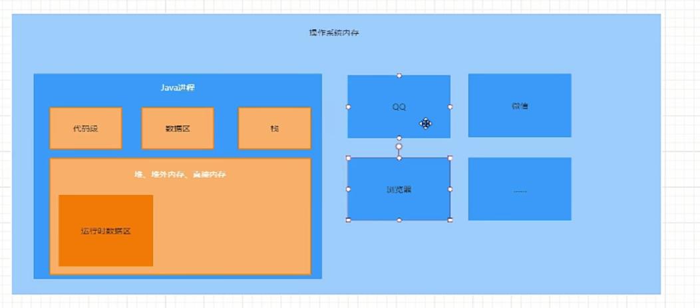
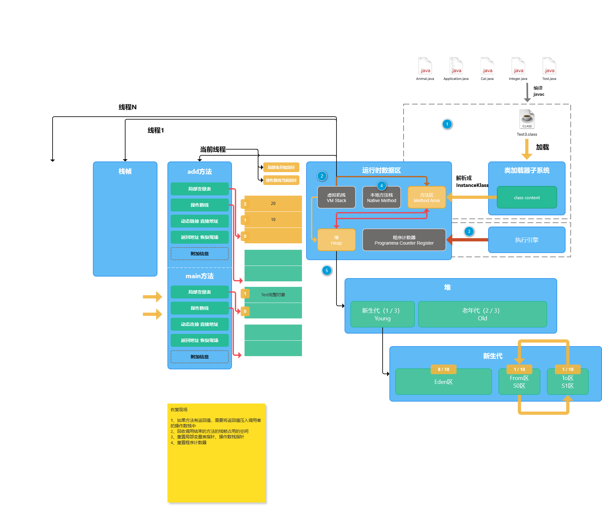
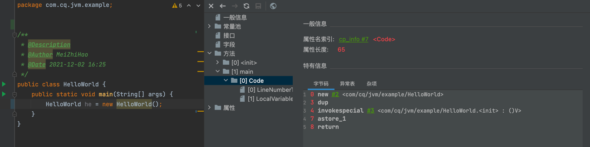

# 第4节：JVM内存模型与操作系统内存模型

> 我是jz，从业两年谈过需求，做过设计，组织过系统重构，执着于底层实现，立志做一个造轮子的开发。

## 一、前言
`多思，多想，多学，多做`

在之前的章节我们了解了类加载子系统，实现了一个字节码解释器，那么本节将围绕着jvm的第二块内容内存模型展开

## 二、os内存模型

相信jvm内存模型大家都了解得比较多了，有5个部分组成：方法区，本地方法栈，程序计数器，虚拟机栈，堆。
在jdk8对方法区进行了优化，方法区在jdk 8 之前叫永久代， jdk之后改为了元空间

注：方法区是一种虚拟机规范、 永久代和元空间则是不同版本虚拟机的不同实现

jdk8之前：永久代(方法区)在堆上；
jdk8之后：永久代(方法区)迁移到了直接内存;

如何理解直接内存呢？



在os中，会为我们的java应用分配一个进程(内存空间)，有代码段、数据区、系统栈、进程堆。
我们程序能操作的内存就在进程堆中

ps:c中可以通过malloc申请内存;  c++通过new; java中可以使用unsafe类操作内存；

klass模型：在进程的堆区(方法区) 那jvm如何将它放到jvm的堆区的呢？

## 三、jvm内存模型

简单的了解了一下os内存模型后，让我们进入今天的重点，jvm内存模型



1.程序计数器: 就是一个指针 int pc 定位到程序行数

2.本地方法栈:存放本地方法的地方，因为能够操作硬件的语言只有c、c++、汇编，所以当我们要区操作操作系统时，就需要先使用c/c++实现一个Library，通过System.loadLibrary加载类库，通过public static native void...

JNI:https://www.runoob.com/w3cnote/jni-getting-started-tutorials.html 

注:当jvm启动时就崩溃，一定是JNI异常，可以通过try/catch(Throwable);

3.虚拟机栈：每一个线程都会创建一个虚拟机栈，

那一个虚拟机栈中有多少栈帧呢？ 有方法个数个，调用多少栈帧就有多少个栈帧

栈帧中有什么？

1.局部变量表:用于存储局部变量，使用4B slot存储

    那么问题来了，局部变量表如果使用4B 的插槽去存储，那double和float 8B 如何存储呢？

```text
double 存储结构
假设一个数 11 22 33 44 55 66 77 88
那么把这个数按4B 分为两个int
11 22 33 44 int   double
55 66 77 88 int

在使用时,先判断类型，如果时double和float，那么就一次取两个float 
```


2.操作数栈:中间层，做运算 赋值的时候 并不是直接赋值，而是先存入局部变量表。

3.动态链接   间接引用链接成直接应用

4.返回地址 调用方法时 return的地址  假设在代码15行调用test()，int pc = 15，当test()执行完成后返回15行。

5.轻量级锁 LockRecord


## 四、对象创建



使用jclasslib 查看指令码

1.  0 new #2 <com/cq/jvm/example/HelloWorld>

堆申请内存(不完全对象)构造方法未执行

内存地址押入操作数栈

2. 3 dup  duplicate

赋值栈顶元素

再次压入栈

为什么要复制呢？

3. 4 invokespecial #3 <com/cq/jvm/example/HelloWorld.<init> : ()V>

执行方法

回答之前的问题，因为这是调用的静态方法，所以默认参数上会有一个this指针
但是此时的this = null，所以我们需要先给this一个值。

执行方法步骤：
    1）构建环境：创建栈帧  传参  保存现场 给this指针赋值
    2）执行

4. 7 astore_1

   1) pop出元素:对象的指针
   2) 赋值给index = 1的位置的变量(局部变量表)


讲完了对象的创建过程，那么 DCL为什么需要volatile呢？

因为cpu乱序执行，在高并发情况下，可以会拿到不完全对象，这时候就需要利用volatile的 禁止指令重排


## 堆区
 
堆区默认的最小内存为物理内存 1/64 最大为 1/4

新生代 1/3 老年代 2/3

老年代存储的对象

1. gc>15的对象: 为什么是15呢？因为在对象头中，只分配了4B 也就是 0000 - 1111 = 0-15;
2. 空间担保机制
3. 动态年龄判断机制
4. 大对象  超过eden区1/2 直接进入老年代


