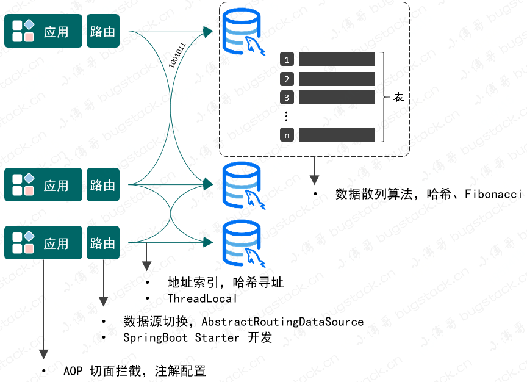

# 第1节：基于springBoot实现分库分表路由插件.md
>我是jz，从业两年谈过需求，做过设计，组织过系统重构，执着于底层实现，立志做一个造轮子的开发。

## 一、前言
`多思，多想，多学，多做`

为什么要自己去实现一个路由插件呢？主要是因为之前写项目的时候一部分业务需要分库分表实现,所以去看了
Sharding jdbc框架，在项目中我也仅仅只是需要使用一个Sharding jdbc做一个分库分表路由，如果引入框架
的化，就会使项目变得冗余，所以我决定自己去实现一个路由插件

## 二、分库分表的主要操作

在开始动手之前我们需要先了解一下分库分表的主要操作

1. 垂直拆分：指按照业务将表进行分类，分布到不同的数据库上，这样也就将数据的压力分担到不同的库上面。最终一个数据库由很多表的构成，每个表对应着不同的业务，也就是专库专用。

2. 水平拆分：如果垂直拆分后遇到单机瓶颈，可以使用水平拆分。相对于垂直拆分的区别是：垂直拆分是把不同的表拆到不同的数据库中，而本章节需要实现的水平拆分，是把同一个表拆到不同的数据库中。如：user_001、user_002

## 三、实现思路(实现方案)

1. 首先我们要告诉程序地方需要使用路由，使用AOP，定义注解，在需要使用路由的方法上进行拦截,便于处理分库分表逻辑。

2. 数据源的切换操作，既然有分库那么就会涉及在多个数据源间进行链接切换，以便把数据分配给不同的数据库。使用Spring Config 进行动态数据源配置

3. 数据库表寻址操作，一条数据分配到哪个数据库，哪张表，都需要进行索引计算。在方法调用的过程中最终通过 ThreadLocal 记录。

所以需要包含的技术 AOP、数据源切换、散列算法、哈希寻址、ThreadLocal以及SpringBoot的Starter开发方式



## 四、设计实现

1. 定义路由注解

```text
   @Documented
   @Retention(RetentionPolicy.RUNTIME)
   @Target({ElementType.TYPE, ElementType.METHOD})
   public @interface DBRouter {
        String key() default "";
   }
```

2.切面拦截

在AOP切面中需要进行: 数据库路由计算，扰动函数加强散列、计算库表索引、设置到 ThreadLocal 传递数据源

```text
@Around("aopPoint() && @annotation(dbRouter)")
public Object doRouter(ProceedingJoinPoint jp, DBRouter dbRouter) throws Throwable {
    String dbKey = dbRouter.key();
    if (StringUtils.isBlank(dbKey)) throw new RuntimeException("annotation DBRouter key is null！");

    // 计算路由
    String dbKeyAttr = getAttrValue(dbKey, jp.getArgs());
    int size = dbRouterConfig.getDbCount() * dbRouterConfig.getTbCount();

    // 扰动函数
    int idx = (size - 1) & (dbKeyAttr.hashCode() ^ (dbKeyAttr.hashCode() >>> 16));

    // 库表索引
    int dbIdx = idx / dbRouterConfig.getTbCount() + 1;
    int tbIdx = idx - dbRouterConfig.getTbCount() * (dbIdx - 1);   

    // 设置到 ThreadLocal
    DBContextHolder.setDBKey(String.format("%02d", dbIdx));
    DBContextHolder.setTBKey(String.format("%02d", tbIdx));
    logger.info("数据库路由 method：{} dbIdx：{} tbIdx：{}", getMethod(jp).getName(), dbIdx, tbIdx);
   
    // 返回结果
    try {
        return jp.proceed();
    } finally {
        DBContextHolder.clearDBKey();
        DBContextHolder.clearTBKey();
    }
}

```

首先我们提取了库表乘积的数量，把它当成 HashMap 一样的长度进行使用。

接下来使用和 HashMap 一样的扰动函数逻辑，让数据分散的更加散列。

当计算完总长度上的一个索引位置后，还需要把这个位置折算到库表中，看看总体长度的索引因为落到哪个库哪个表。

最后是把这个计算的索引信息存放到 ThreadLocal 中，用于传递在方法调用过程中可以提取到索引信息。

3.Mybatis 拦截器处理分表

```text

@Intercepts({@Signature(type = StatementHandler.class, method = "prepare", args = {Connection.class, Integer.class})})
public class DynamicMybatisPlugin implements Interceptor {


    private Pattern pattern = Pattern.compile("(from|into|update)[\\s]{1,}(\\w{1,})", Pattern.CASE_INSENSITIVE);

    @Override
    public Object intercept(Invocation invocation) throws Throwable {
        // 获取StatementHandler
        StatementHandler statementHandler = (StatementHandler) invocation.getTarget();
        MetaObject metaObject = MetaObject.forObject(statementHandler, SystemMetaObject.DEFAULT_OBJECT_FACTORY, SystemMetaObject.DEFAULT_OBJECT_WRAPPER_FACTORY, new DefaultReflectorFactory());
        MappedStatement mappedStatement = (MappedStatement) metaObject.getValue("delegate.mappedStatement");

        // 获取自定义注解判断是否进行分表操作
        String id = mappedStatement.getId();
        String className = id.substring(0, id.lastIndexOf("."));
        Class<?> clazz = Class.forName(className);
        DBRouterStrategy dbRouterStrategy = clazz.getAnnotation(DBRouterStrategy.class);
        if (null == dbRouterStrategy || !dbRouterStrategy.splitTable()){
            return invocation.proceed();
        }

        // 获取SQL
        BoundSql boundSql = statementHandler.getBoundSql();
        String sql = boundSql.getSql();

        // 替换SQL表名 USER 为 USER_03
        Matcher matcher = pattern.matcher(sql);
        String tableName = null;
        if (matcher.find()) {
            tableName = matcher.group().trim();
        }
        assert null != tableName;
        String replaceSql = matcher.replaceAll(tableName + "_" + DBContextHolder.getTBKey());

        // 通过反射修改SQL语句
        Field field = boundSql.getClass().getDeclaredField("sql");
        field.setAccessible(true);
        field.set(boundSql, replaceSql);

        return invocation.proceed();
    }

}


```

4. 配置动态数据源

```text

@Bean
public DataSource dataSource() {
    // 创建数据源
    Map<Object, Object> targetDataSources = new HashMap<>();
    for (String dbInfo : dataSourceMap.keySet()) {
        Map<String, Object> objMap = dataSourceMap.get(dbInfo);
        targetDataSources.put(dbInfo, new DriverManagerDataSource(objMap.get("url").toString(), objMap.get("username").toString(), objMap.get("password").toString()));
    }     

    // 设置数据源
    DynamicDataSource dynamicDataSource = new DynamicDataSource();
    dynamicDataSource.setTargetDataSources(targetDataSources);
    dynamicDataSource.setDefaultTargetDataSource(new DriverManagerDataSource(defaultDataSourceConfig.get("url").toString(), defaultDataSourceConfig.get("username").toString(), defaultDataSourceConfig.get("password").toString()));

    return dynamicDataSource;
}

```

5.打包测试

```xml
    <groupId>com.cq</groupId>
    <artifactId>db-router-starter</artifactId>
    <version>1.0-SNAPSHOT</version>
    <packaging>jar</packaging>
```
引入jar包

```text
# 多数据源路由配置
mini-db-router:
  jdbc:
    datasource:
      dbCount: 2
      tbCount: 4
      default: db00
      list: db01,db02
      db00:
        url: 
        driver-class-name: 
        username: 
        password: 
      db01:
        url: 
        driver-class-name: 
        username: 
        password:
      db02:
        url: jdbc:
        driver-class-name: 
        username: 
        password: 
```

配置数据源

```text

@Mapper
public interface IUserDao {

     @DBRouter(key = "userId")
     User queryUserInfoByUserId(User req);

     @DBRouter(key = "userId")
     void insertUser(User req);

}
```

注:实现动态数据源配置时需要使用spring.factories文件映射配置类

org.springframework.boot.autoconfigure.EnableAutoConfiguration=com.cq.middleware.db.router.config.DataSourceAutoConfig

spring.factories: https://www.jianshu.com/p/00e49c607fa1

项目地址:https://gitee.com/jz_zzh/db-router-starter.git


