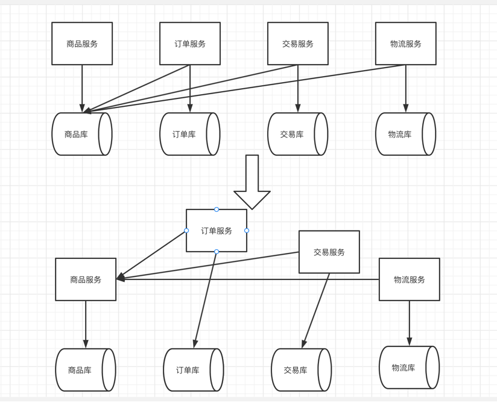
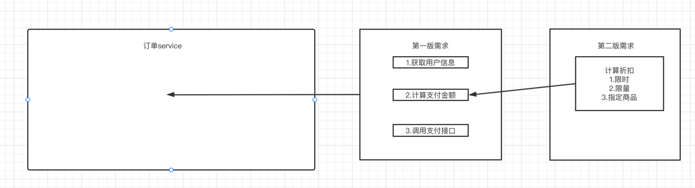
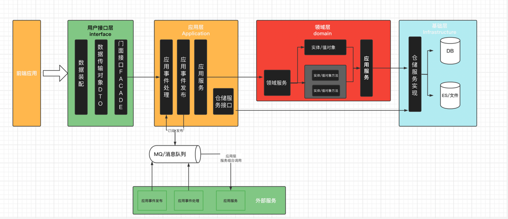

# 第2节：DDD领域驱动设计.md
>我是jz，从业两年谈过需求，做过设计，组织过系统重构，执着于底层实现，立志做一个造轮子的开发。

## 一、前言
`多思，多想，多学，多做`

DDD(Domain-Driven Design)领域驱动设计,是最近挺火的一种设计方案，但是网上关于DDD的介绍,什么六边形架构模型，什么领域专家、设计人员、开发人员都能理解的通用语言作为相互交流的工具，实在是太过于抽象,

其实对于初次接触到ddd的初学者来说，我们只需要知道 1.DDD解决了什么 2.DDD怎么应用

## 二、DDD解决了什么

《在软件核心复杂性应对之道》一书中，明确的提出了ddd是应对系统规模过大时引起的软件复杂性的问题的一个开放的设计方法体系。

随着软件的业务不断膨胀，版本不停迭代，造成了代码中动辄上千行的业务逻辑使软件变得难以维护，使得软件退化。

那我们应该如何阻止这种软件的退化了？这时候我们就可以用到DDD的软件设计了。

DDD:领域驱动,核心是领域，那什么又是领域呢？其实就是

`透过业务，还原到现实生活中的真实事件,再根据真实事件指导领域变更，也就是回归到面向对象设计`

## 三、微服务架构落地

我们在单体应用拆分为微服务的跟源之一便是:将越来越复杂的系统拆分为多个服务，降低维护成本

但是微服务却没有发挥出降低维护成本的作用，往往修改一个服务就需要牵扯到多个服务的修改，需要多个团队共同维护，
反而增大了维护成本。

在Martin Fowler的微服务中是这样定义微服务的  `小而专`

在微服务开发中我们往往只get到了小，而忽略掉了专

怎么理解这个专呢？专一维护，尽量让每次需求变更让某个小团队对立维护。

所以微服务的变更不仅仅是技术架构更迭，而是对原有的设计提出了更高的要求

`服务内部高内聚,服务之间低耦合`

我们将微服务拆分后，并不意味这服务和服务之间独立的运行，而是彼此协作的组织在一起，
而ddd正好可以作为帮助我们实现服务之间组织的实践方法

### 微服务实践落地不得不考虑的问题

如图所示,所有的服务都需要访问商品信息，如果每个服务都访问商品库的化，那么当商品库的表结构发生变更就会导致每个服务都
要进行相应的变更，这显然不符合微服务的初衷。

所以我们选择第二种设计，按照服务划分各个服务数据库的访问权限，服务之间通过接口获取数据

这时,我们就不得不面临微服务的问题：

1.当每一个团队都给你提出数据接口时，应该怎么去设计？

如果根据每一个团队的需求，那么整个整个服务就会变得不稳定。所以当每一个团队提出数据接口需求时，需要对接口进行合理规划
尽量做到复用，尽可能少的接口满足需求。

2.当有团队提出变更现有接口需求时，需要尽可能向前兼容，不影响其他接口。

#### 数据库设计

在我们将一个系统拆分成微服务，也将统一的一个数据库按用户进行了划分。

1.对于频繁查询，数据量不大的数据库可以选用 可以选用redis + mysql

2.对于数据量大，并发高的服务，使用 newSql、分布式云存储 (目前没有接触过此类常见，感兴趣的同学自行研究)

3.对于数据量大的查询分析业务 选用es

对数据库进行拆分后，我们就不能直接使用left join 等一些关联查询去进行数据关联了(其实在大数据环境下，即使没有拆分数据库，也应该去掉这种联表查询
,在单表数据达到一定的量级的时候,left join会严重影响性能)。所以我们只能通过接口获取主表数据，然后采用数据补全的方式进行。

在一些情况下需要灵活增加冗余字段，来提高性能。比如订单需要关联用户信息，我们需要先拿到订单，再去用户服务获取用户信息。如果我们只需要用户信息的某几个字段的话，
我们可以在订单表适当的增加是一些用户信息。

在需要对多服务多数据多个字段进行过滤的情况下，可以合理使用NoSql设计宽表，提前将数据join。

## 四、微服务与DDD

聊完微服务的设计，现在回到我们的主题，微服务与DDD结合。过去，我们说架构是软件系统最稳定的一部分，而现在，好的架构是不断技术更替的

### 架构更替痛点分析

1.底层技术架构更替困难:在过去的开发中，开发流程往往是先定义数据模型，搭建基础框架，然后由业务层调用基础框架实现。

举个例子：现在一个系统由 hibernate 转换为 mybatis 会导致整个代码，由下而上开始崩溃。业务代码高度耦合底层框架，使得框架无法更替

2.传统的mvc开发定义bean模型是一个贫血模型，所有的业务逻辑交由service层处理。在业务需求不断迭代，会是service层代码不断膨胀变得不可维护

### ddd是如何解决这些问题的

那ddd是如何解决这样的问题的呢？我们先看一些ddd模型的结构图

按照惯例，我们先了解一下ddd架构每一层的作用

1.接口层：接口服务位于用户接口层，用于处理用户发送的Restful请求和解析用户输入的配置文件等，并将信息传递给应用层。

2.应用层: 负责服务组合、编排和转发、负责处理业务用例的执行顺序以及结果拼装,以及领域事件的发布和订阅。通过事件总线和消息队列实现异步数据传输，实现微服务之间的解耦

3.领域层:回归面向对象，设计充血模型，将事件通过接口暴露给外部

4.基础层:提供持久层仓储服务

上文提到了贫血模型和充血模型:我们先解释一下什么是贫血模型:贫血模型简单来说就是将属性和行为分离，而充血模型，就是定义好了领域的界限，封装了对象的属性和方法;

ok，了解了这些之后，我们就来说说ddd如何解决mvc中的问题的

首先，底层框架难以更替是应用 mvc设计高度耦合了底层框架，所以在ddd的设计中，将业务、领域、数据模型完全解耦
在应用层对 业务进行解耦，在基础层对领域层和数据模型进行解耦，再由应用层对领域层暴露的接口进行流程编排，如此
便形成了一个`低耦合，高内聚`的微服务架构

不过之前在写博客的时候发现了另一种ddd实现的思路，参考了阿里张建飞老师的COLA架构，他的设计是 领域层作为ddd设计的核心不应该依赖于基础层，而是领域层暴露接口，由基础层去实现
感兴趣的小伙伴可以自行研究

COLA架构:https://github.com/alibaba/COLA