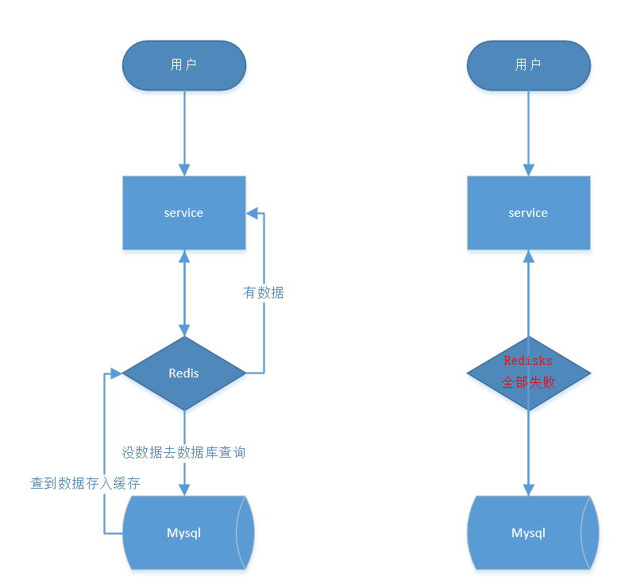

# 第4节：雪崩、穿透、击穿
>我是jz，从业两年谈过需求，做过设计，组织过系统重构，执着于底层实现，立志做一个造轮子的开发。

## 一、前言
`多思，多想，多学，多做`

相信在大多数实际开发过程中对缓存雪崩，穿透，击穿都不会陌生，就算没有遇到过也肯定听说过，那么
我们应该如何去防止这样的情况发生呢？

## 二、缓存雪崩

首先我们先来说说缓存雪崩，一般在我们的系统中，一些字典以及热点数据都会去做缓存
，一般缓存都是使用定时任务去刷新，或者是查询不到时再去更新数据。

那么如果是定时任务刷新就会产生一个问题

举个简单的例子，假如热点数据key失效时间是12小时，那么当12小时后，热点数据key全部失效，大量qps就会
直接打到数据库中。



所以缓存雪崩就是在同一时间缓存大面积失效，导致大量qps直接打到数据库上，导致数据库直接挂掉或者数据库连接数被占用，
导致所有依赖该库出现异常，如果没做熔断策略，甚至会导致服务挂掉。

那么该怎么应对缓存雪崩呢？

1.在设置数据时，将key的失效时间设置为随机值,确保在同一时间缓存不会大面积失效

``
setRedis（Key，value，time + Math.random() * 10000）；
``

2.设置热点数据永不过期

## 三、缓存穿透

再来说说缓存穿透，缓存穿透是指缓存和数据库中都没有的数据，而用户不断发送请求，导致数据库压力过大，击垮数据库


既然缓存穿透是应用不断的请求缓存和数据库中都没用的数据，那么解决缓存穿透问题就变得简单了

1.我们可以在接口层增加校验，比如用户鉴权，参数校验，对于不合法的参数 直接return
(永远保持一颗不信任的心，不要相信接口调用方，会按照设想的参数进行调用)

2.当参数合法，并且缓存和数据库都获取不到数据，那么将key设置到缓存中,设置过期时间

3.还可以使用上一节说到的布隆过滤器快速判断key是否存在缓存中，不存在去数据库中获取，存在直接返回

## 四、缓存击穿

最后就是缓存击穿，缓存击穿跟缓存雪崩类似，但缓存雪崩是缓存大面积失效，而缓存击穿是一个超级热点key，在不停的扛着大并发，大并发集中对这一个点进行访问，当这个Key在失效的瞬间，持续的大并发就穿破缓存，直接请求数据库

而解决缓存击穿

1.同样设置热点数据永不过期

2.当缓存过期去数据库获取数据时加上互斥锁
```java
public class demo{
    public static String getData(String key) throws InterruptedException{
        //从redis获取数据
        String result = getDataByKV(key);
        //检查是否获取到数据
        if (StringUtils.isBlank(result)){
            //获取锁
            if (reenLock.tryLock()){
                result = getDataByDB(key);
                if (StringUtils.isNotBlank(result)){
                    setDataToKV(key,result);
                }else{
                    setDataToKV(key,null);
                }
                //释放锁 正常会在finally里面释放
                reenLock.unLock();
            } else{
                Thread.sleep(100L);
                result = getDataByKV(key);
            }
        }
        return  result;
    }
}
```


