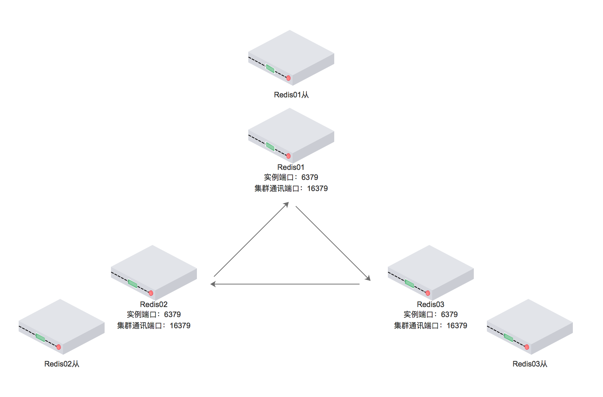

# 第5节:Redis集群、持久化、主从.md
>我是jz，从业两年谈过需求，做过设计，组织过系统重构，执着于底层实现，立志做一个造轮子的开发。

## 一、前言
`多思，多想，多学，多做`

Redis是基于内存的单进程单线程模型的KV数据库

完全基于内存，数据存储类似于HashMap，查找和操作的时间复杂度都是O(1)

采用单线程，避免了不必要的上下文争抢，也不存在多线程或者多进程导致的切换而消耗cpu，不存在加锁释放锁的操作

使用多路复用I/O模型

那为什么redis使用单线程呢？

官方回答：`因为Redis是基于内存的操作，CPU不是Redis的瓶颈，Redis的瓶颈最有可能是机器内存的大小或者网络带宽。既然单线程容易实现，而且CPU不会成为瓶颈，那就顺理成章地采用单线程的方案了。`

既然提到了redis的瓶颈那又应该如何解决呢？

## 二、redis集群

###1.hash slot 详细见第二节

###2.redis-cluster

图中集群由6个redis实例构成，6379端口为客户端通讯端口  16379端口为集群总线端口

将16384个数据分槽，分布在三个主redis中，从redis中没有分槽，仅仅作为数据备份

这样整个 Redis 就可以横向扩容了。如果你要支撑更大数据量的缓存，那就横向扩容更多的 master 节点，每个 master 节点就能存放更多的数据了。

虽然这个时候我们已经实现了redis集群，但是新的问题有出现了 `节点之间如何进行数据交互？`、`redis如何进行持久化？`

## 三、redis持久化

持久化是Redis 高可用中一个重要的环节，redis的持久化主要有两种：`RDB`、`AOF`

1.RDB 持久化机制是对Redis中的数据执行周期性的持久化，会将Redis中全量数据进行压缩保存，可通过sava 或者bgsave立即触发

优点：RDB对Redis的性能影响非常小，是因为在同步数据的时候他只是fork了一个子进程去做持久化的，而且他在数据恢复的时候速度比AOF来的快。

缺点：RDB是快照文件，周期性的执行，所以如果在数据同步之前，发生故障，会丢失周期内的所有数据

2.AOF 机制是对每条写入命令作为日志，以append-only的模式写入一个日志文件中

优点：AOF默认配置每一秒就会通过后台的线程fsync操作，如果发生故障最对丢失一秒的数据，并且AOF在对日志文件操作时是以
append-only的方式去写，写入性能高

缺点：因为AOF是记录每一次写入命令，所以相同的数据AOF文件比RDB文件大，数据恢复速度比RDB慢

在开启AOF时，redis会优先从AOF中恢复数据，但是恢复速度比较缓慢

在redis5之后支持混合使用，混合持久化本质是通过 AOF 后台重写（bgrewriteaof 命令）完成的，不同的是当开启混合持久化时，fork 出的子进程先将当前全量数据以 RDB 方式写入新的 AOF 文件，然后再将 AOF 重写缓冲区（aof_rewrite_buf_blocks）的增量命令以 AOF 方式写入到文件，写入完成后通知主进程将新的含有 RDB 格式和 AOF 格式的 AOF 文件替换旧的的 AOF 文件。

## 四、集群高可用

说完了持久化，那我们在来说说集群高可用，如何保证集群的高可用呢？

在redis中，还有sentinel集群(哨兵集群)

为了保证自身的健壮性，必须使用3个实例，哨兵+主从可以保证集群的高可用。

### 为什么要使用三个实例才能保证健壮性呢？

现在是两个哨兵的集群
当master宕机后 s1和s2两个哨兵只要有一个认为宕机了就切换，
并且会选举一个哨兵去执行故障，但这个时候也需要大多数哨兵都是运行的

当master宕机后，s1正常运行这样是没有问题的，但是当整个机器都挂了的化
，哨兵就只剩下s2，没有哨兵去做故障转移

一般的哨兵集群是这样的，M1所在的机器挂了，哨兵还有两个，选举一个出来执行故障转移

哨兵组的主要功能

1.集群监控：负责监控 Redis master 和 slave 进程是否正常工作 。

2.消息通知：如果某个 Redis 实例有故障，那么哨兵负责发送消息作为报警通知给管理员。

3.故障转移：如果 master node 挂掉了，会自动转移到 slave node 上。

4.配置中心：如果故障转移发生了，通知 client 客户端新的 master 地址。

### 主从同步

启动一台slave 的时候，他会发送一个psync命令给master ，如果是这个slave第一次连接到master，
他会触发一个全量复制。master就会启动一个线程，生成RDB快照，还会把新的写请求都缓存在内存中，RDB文件生成后，
master会将这个RDB发送给slave的，slave拿到之后做的第一件事情就是写进本地的磁盘，然后加载进内存，
然后master会把内存里面缓存的那些新命名都发给slave。

