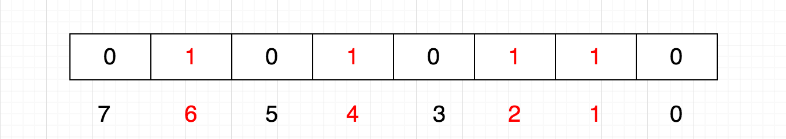
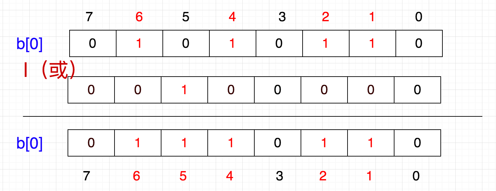
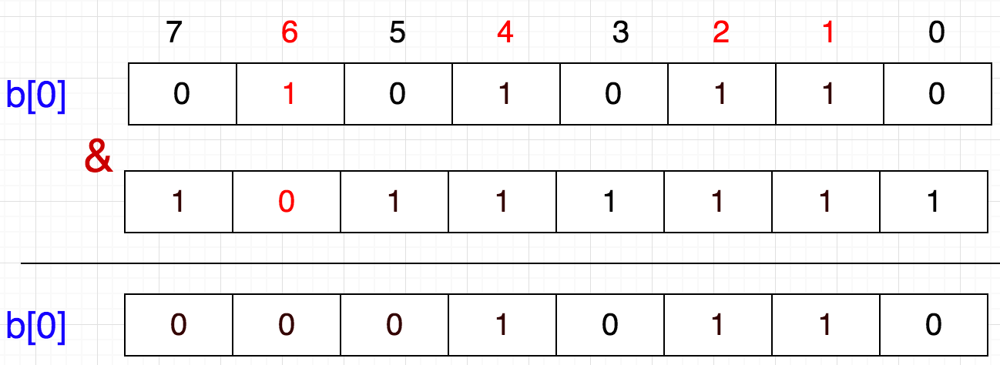

# 第3节：聊聊redis(数据结构+缓存问题)
>我是jz，从业两年谈过需求，做过设计，组织过系统重构，执着于底层实现，立志做一个造轮子的开发。

## 一、前言
`多思，多想，多学，多做`

ok，水了两期今天我们开始进入整体redis,首先咱说说redis的数据结构。redis有5总基本数据结构:String、Hash、List、Set、Zset

## 二、基础数据结构应用

### String的应用场景

String是redis最常用的数据结构，我们都知道redis是又c语言编写的，但redis却没有直接使用String类型,内部通过SDS(Simple Dynamic String)来存储的。

SDS：类似于ArrayList，通过预分配冗余空间的方式减少内存的频繁分配
    
1.缓存功能:String 字符串是最常用的数据类型,配合其他数据库作为存储层,利用Redis支持高并发的特点，加快系统读写速度

2.计数器

3.共享用户session: 将Session集中管理

### Hash

Hash 类似Map的结构，一般用于缓存结构化数据，每次读写缓存，可以操作Hash里的某一个字段

### List

List 有序列表,存储一些列表型的数据结构，比如文章的评论列表之类的。

可以通过Lrange命令,读取某个闭区间的元素，可以基于List实现高性能分页

可以用于小型队列的实现

### Set

Set 无序集合，不允许重复。 用于快速全局去重

### Sorted Set

排序的set，主要用于排行榜实现

## 三、高级应用

redis的五大基本数据类型相信大家都或多或是的使用或者了解过，那么接下来就聊聊redis一些高级用法

### 1.BitMap

BitMap：位图，用一个bit位来标记某个元素对应的Value，而key就表示该元素，采用bit为单位存储数据，节省存储空间

那么bitMap是如何来表示数据的呢？

在BitMap中每一位都表示一个数，0表示不存在,1表示存在

现在需要表示{1,2,4,6}


在java中一个int占用32位，所以我们只需要申请一个int数组长度为int tmp[1+N/32]即可存储

tmp[0]:表示0-31

tmp[1]:表示32-63

.......

如此一来，给定任意整数m,那么m/32就能得到下表，m%32就知道此下标的位置;

#### BitMap添加

知道了BitMap怎么存储，那么我们要怎么将一个数字放进去呢？ 假设需要把5放入其中(5/8=0，5%8=5) 所以5在tmp[0]第6个位子


由此可以得出: p + (i/8)|(1<<(i%8)) 其中，p表示现在的值，i表示待插入的数


#### BitMap删除
假设需要需要清除6，只需要将6所在的位置设置为0

所以 1左移6位，就达到了6这个数字所代表的位，然后按位取反，最后与原数按位与


由此推出: b[0] = b[0]&(~(1<<(i%8)))

#### BitMap查找

前面我们也说了，每一位代表一个数字，1表示存在，0表示不存在。所以，我们判断一个数是否存在
只需要：b[0] & (1 << i)

如果这个值是0，则不存在，如果是1则表示存在

#### Bitmap java实现
```java
public class BitMap{
    private byte bitMap [];
    private int length;
    
    public boolean get(int number){
        //获取位置 
        int site = number >>> 3;
        //获取该字节
        byte temp = bitMap[site];
        //获取该字节第几个
        int i = number & 7;
        
        byte comp = 1;
        if (((temp>>>(7-i))&1) == 0){
            return false;
        }
        return true;
    }
    
    public void set(int number,boolean bool){
        //获取位置 
        int site = number >>> 3;
        //获取该字节
        byte temp = bitMap[site];
        //获取该字节的第几个
        int i=number&7;//等价于 i=number%8
        //将0000 0001 左移(7-i)
        byte comp= (byte) (1<<(7-i));

        if(bool){//设置为1
            bitmap[site]= (byte) (comp|temp);//取或(0.. 1 0..)
        }else {//设置为0
            comp= (byte) ~comp;//取反
            bitmap[site]= (byte) (comp&temp);//相与(1.. 0 1..)
        }
    }

    public void add(int index){
        set(index,true);
    }
    public void delete(int index){
        set(index,false);
    }

    public Bitmap (int length){
        this.length=length;
        bitmap=new byte[length>>>3];
    }

    public int getLength() {
        return length;
    }
    
}
```

#### Bitmap用途

大量数据的快速排序，查找，去重复

快速排序、去重,对0-x内的元素进行排序，只需要 (x/8)+1 个byte，将对应的的值设置为1,在依次输出byte中的位置;

查找：int 占用4字节 32位，那么除以32知道元素下标，再%32 获取到第几位，如果是1 表示存在

BitMap 优点：

占用内存空间低，可以极大地节约空间；

运算效率高，查找、去重都不需要遍历全部数据；

缺点：

所有的数据不能重复，相当于直接就是排重过的；

如果数据只有两个：1 和 10000000，使用 BitMap 得不偿失，只有当数据比较密集时才有优势。

#### Bloom Filters

Bloom filter是一个基于概率的数据结构：它只能告诉我们一个元素绝对不在集合内或可能在集合内。具有运行快速，内存占用小的特点
主要应用于大规模不需要精确过滤的场景(解决缓存穿透问题)

如果想判断一个元素是不是在一个集合里，一般想到的是将集合中所有元素保存起来，然后通过比较确定。链表、树、散列表（哈希表）等等数据结构都是这种思路，但是随着集合中元素的增加，需要的存储空间越来越大；同时检索速度也越来越慢，检索时间复杂度分别是O(n)、O(log n)、O(1)。

布隆过滤器的原理是，当一个元素被加入集合时，通过 K 个散列函数将这个元素映射成一个位数组（Bit array）中的 K 个点，把它们置为 1 。检索时，只要看看这些点是不是都是1就知道元素是否在集合中；如果这些点有任何一个 0，则被检元素一定不在；如果都是1，则被检元素很可能在（之所以说“可能”是误差的存在）。

Bloom filter 流程
1. 首先需要k个hash函数，每个函数可以把key散列成1个整数;
2. 初始化时，需要一个长度为n 比特的数组，每个比特位初始化位0；
3. 某个key加入集合时，用k个hash函数计算出k个散列值，并把数组中对应的比特位置为 1；
4. 判断某个 key 是否在集合时，用 k 个 hash 函数计算出 k 个散列值，并查询数组中对应的比特位，如果所有的比特位都是1，认为在集合中


