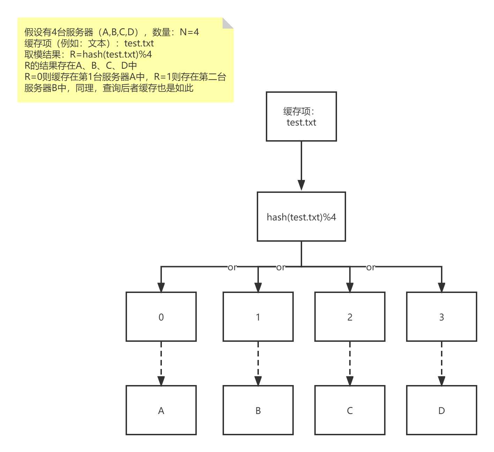
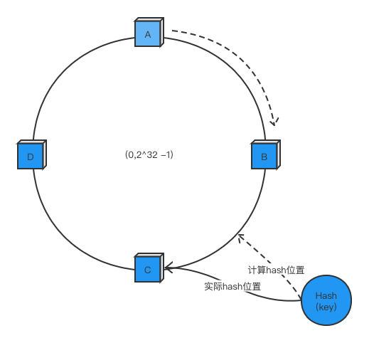

# 第2节：缓存寻址算法
>我是jz，从业两年谈过需求，做过设计，组织过系统重构，执着于底层实现，立志做一个造轮子的开发。

## 一、前言
`多思，多想，多学，多做`

上一篇文章简单的介绍了缓存类型，以及多级缓存一些实现想法，那么在缓存中如何通过get key找到对应的value呢？
这就得说到key的寻址算法了，目前常见的寻址算法主要有：hash算法、一致性hash算法、hash slot

## 二、hash算法(取模运算)
对于key计算hash，然后对节点数取余，打到不同的节点上。



hash算法基本上能够满足绝大多数的路由需求，但是，在分布式缓存集群需要扩容的时候，就会存在一些问题。

当我们对集群进行增加节点或者减少节点时通过hash算法会使之前的绝大多数数据失效，需要重新加载数据,导致大量数据涌入数据库

```java
public class hash {
    public static void main(String[] args) {
        String hash = "abc";
        // hashCode  96354
        System.out.println(hash.hashCode());
        //假设 有 3个节点取模运算
        int before = 96354 % 3 ;
        System.out.println("当节点为8时：key 分布在" + before);  //0
        // 这是扩容到4个节点
        int after = 96354 % 4;
        System.out.println("当节点为9时：key 分布在" + after);  //2
    }
}
```



hash一致性算法：先构建一个长度为2^32整数环，根据 N个节点的节点名称取hash值[0,2^32-1]放到环上。存放资源时，根据key 的hash，在环上顺时针找到离 key的hash最近的节点

在一致性哈希算法中，如果一个节点挂了，受影响的数据仅仅是此节点到环空间前一个节点（沿着逆时针方向行走遇到的第一个节点）之间的数据，其它不受影响。增加一个节点也同理。


但是一致性hash算法也存在这一定的缺陷，当节点太少时，容易因为节点分布不均匀而造成缓存热点的问题。

```java

import java.util.SortedMap;
import java.util.TreeMap;

/**
 * @Description
 * @Author MeiZhiHao
 * @Date 2021-12-02 16:25
 */
public class DHT {
    public static void main(String[] args) {
        DHT();
    }
    
    private static SortedMap<Integer, String> sortedMap = new TreeMap<Integer, String>();

    private static void DHT(){
        //节点列表
        String [] server = {"node1","node2","node3"};

        for (int i = 0; i<server.length; i++){
            int hash = getHash(server[i]);
            System.out.println("[" + server[i] + "]加入集合中, 其Hash值为" + hash);
            sortedMap.put(hash, server[i]);
        }
        String[] keys = {"太阳", "月亮", "星星"};
        for (int i = 0; i < keys.length; i++) {
            System.out.println("[" + keys[i] + "]的hash值为" + getHash(keys[i])
                    + ", 被路由到结点[" + getServer(keys[i]) + "]");
        }
    }

    /**
     * 32位Hash算法
     * @param str
     * @return
     */
    private static int getHash(String str){
        final int p = 16777619;
        int hash = (int) 2166136261L;
        for (int i = 0; i < str.length(); i++)
            hash = (hash ^ str.charAt(i)) * p;
        hash += hash << 13;
        hash ^= hash >> 7;
        hash += hash << 3;
        hash ^= hash >> 17;
        hash += hash << 5;

        // 如果算出来的值为负数则取其绝对值
        if (hash < 0) {
            hash = Math.abs(hash);
        }
        return hash;
    }

    //得到应当路由到的结点
    private static String getServer(String key) {
        //得到该key的hash值
        int hash = getHash(key);
        //得到大于该Hash值的所有Map
        SortedMap<Integer, String> subMap = sortedMap.tailMap(hash);
        if (subMap.isEmpty()) {
            //如果没有比该key的hash值大的，则从第一个node开始
            Integer i = sortedMap.firstKey();
            //返回对应的服务器
            return sortedMap.get(i);
        } else {
            //第一个Key就是顺时针过去离node最近的那个结点
            Integer i = subMap.firstKey();
            //返回对应的服务器
            return subMap.get(i);
        }
    }
}
```

## 四、hash slot算法

在redis集群中使用了hash slot算法，redis cluster有固定的16384个hash slot，对每个key计算CRC16值，然后对16384取模，获取 key 对应的 hash slot。
hashSlot = SRC16(key) % 16384

假设有一个由3个节点组成的集群，那么3个节点分别覆盖 0－5460、 5461－10922、10923－16383.

[//]: # ()

这时候 set key ****  hash slot:CRC16('key')%16384 = 2412。那么就会把这个key分布在节点A上；

当我们想获取 key 时  get key

会出现两种情况：

1.client 刚好直接访问到Node A,Node A查询自己的hash slot表，发现key在自己节点中，接着处理命令，获取key的值返回客户端。

2.client访问到Node B或者Node C，发现key 在Node A中，返回MOVED error。然后client重定向到该节点。

当我们新增节点时，会从各个节点 各取一部分slot到node D上，这时slot分布为:

节点A覆盖1365-5460

节点B覆盖6827-10922

节点C覆盖12288-16383

节点D覆盖0-1364,5461-6826,10923-12287

[//]: # ()


