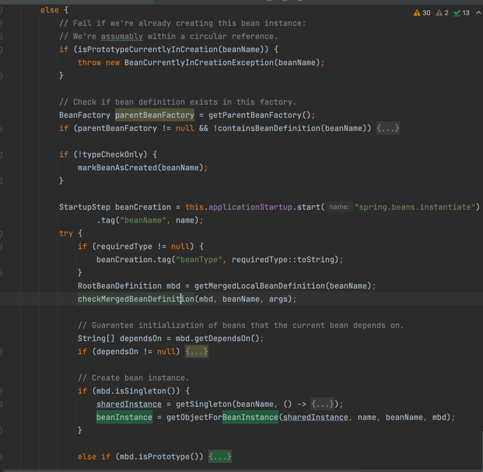

# 第1节：bean的生命周期
>我是jz，从业两年谈过需求，做过设计，组织过系统重构，执着于底层实现，立志做一个造轮子的开发。

## 一、写在前面
`多思，多想，多学，多做`

对于一个java程序员来说，Spring是java开发生态的一个重要组成部分。本专题将会从spring的应用到源码去看看Spring是怎么实现的？

首先在进入源码之前，希望大家能够想一想，为什么要研究源码？研究源码是有一定的门槛的，特别是这种大型的开源项目，在我看来
研究源码的意义在于学习人家优秀的设计思路，站在开发者的角度多想想为什么，以及对使用中出现的问题进行快速定位。

ok，扯远了，让我们回到今天的主题。spring最核心的两个功能 IOC和AOP，而IOC主要是帮助我们去管理bean。所以进入spring源码的第一步
就是Spring 如何创建管理bean。也就是bean的生命周期。

## 二.bean的生成过程

### Bean扫描逻辑

在spring启动时会调用
`org.springframework.context.annotation.ClassPathScanningCandidateComponentProvider#scanCandidateComponents(String basePackage)`
扫描包路径，并得到BeanDefinition的set集合(Spring启动流程后续单独讲);

1.首先获取到包路径下所有的class

``
String packageSearchPath = ResourcePatternResolver.CLASSPATH_ALL_URL_PREFIX + resolveBasePackage(basePackage) + '/' + this.resourcePattern;
Resource[] resources = getResourcePatternResolver().getResources(packageSearchPath);
``

2.通过ASM技术解析每个class文件对象，得到class

``
MetadataReader metadataReader = getMetadataReaderFactory().getMetadataReader(resource);
``

3.通过条件筛选class
``

    isCandidateComponent(metadataReader)

    for (TypeFilter tf : this.excludeFilters) {
        if (tf.match(metadataReader, getMetadataReaderFactory())) {
            return false;
        }
    }

    for (TypeFilter tf : this.includeFilters) {
        if (tf.match(metadataReader, getMetadataReaderFactory())) {
            return isConditionMatch(metadataReader);
        }
    }
``

4.判断是 否是依赖其他类、是否是顶级类、是否是抽象了且包含LookUp注解

5.遍历每个BeanDefinition

    获取beanNam  解析@Component注解所指定的beanName，没有指定会默认生成

    给beanDefinition中的属性赋默认值

    解析@Lazy、@Primary、@DependsOn、@Role、@Description等注解赋值给BeanDefinition

    判断当前beanName是否在Spring 容器中，如果不存在，则把beanName以及BeanDefinition注册到spring容器中，如存在则报错

注：MetadataReader表示类的元数据读取器，主要包含了一个AnnotationMetadata 功能有：

1.获取类的名字

2.获取父类的名字

3.获取所实现的所有接口名

4.获取所有内部类的名字

5.判断是不是抽象类

6.判断是不是接口

7.判断是不是一个注解

8.获取拥有某个注解的方法集合

9.获取类上添加的所有注解信息

10.获取类上添加的所有注解类型集合

CachingMetadataReaderFactory解析某个.class文件得到MetadataReader对象是利用的ASM技术，并没有加载这个类到JVM。并且，最终得到的ScannedGenericBeanDefinition对象，beanClass属性存储的是当前类的名字，而不是class对象

ProcessOn地址：https://www.processon.com/view/link/6233f04a07912907c28e6105#outline


### 创建bean

入口:refresh() --> finishBeanFactoryInitialization(beanFactory)  --> beanFactory.preInstantiateSingletons();

1.在扫描是会将beanName放入一个List

``
List<String> beanNames = new ArrayList<>(this.beanDefinitionNames);
``

2. 合并BeanDefinition,Spring中支持父子BeanDefinition，和Java父子类类似父子BeanDefinition实际用的比较少，使用是这样的，比如：

```xml
<bean id="parent" class="com.cq.service.Parent" scope="prototype"/>
<bean id="child" class="com.cq.service.Child"/>
```
这么定义的情况下，child是单例Bean。

```xml
<bean id="parent" class="com.zhouyu.service.Parent" scope="prototype"/>
<bean id="child" class="com.zhouyu.service.Child" parent="parent"/>
```
但是这么定义的情况下，child就是原型Bean了。

因为child的父BeanDefinition是parent，所以会继承parent上所定义的scope属性。

而在根据child来生成Bean对象之前，需要进行BeanDefinition的合并，得到完整的child的BeanDefinition。

3. 加载类

调用AbstractBeanFactory --> getBean 方法获取创建bean;

首先获取beanName，判断是否有别名，获取别名，从单例池中获取缓存(原始对象)

如果获取到原始对象，根据原始对象获取实例
``
Object sharedInstance = getSingleton(beanName);
if (sharedInstance != null && args == null) {
    if (logger.isTraceEnabled()) {
        if (isSingletonCurrentlyInCreation(beanName)) {
            logger.trace("Returning eagerly cached instance of singleton bean '" + beanName +
            "' that is not fully initialized yet - a consequence of a circular reference");
        }
    else {
        logger.trace("Returning cached instance of singleton bean '" + beanName + "'");
        }
    }
    beanInstance = getObjectForBeanInstance(sharedInstance, name, beanName, null);
    }
``

如果获取不到原始对象 检查是否正在创建，检查是否存在parentBeanFactory 检查是否存在dependsOn注解，


createBean():如果beanClass属性的类型是Class， 那么就直接返回,如果不是， 则会根据类名进行加载(doResolveBeanClass)
会利用BeanFactory所设置的类加载器来加载类，如果没有设置， 则默认使用 ClassUtils.getDefaultClassLoader()所返回的类加载器来加载。

ClassUtils.getDefaultClassLoader()

1.优先返回当前线程中的ClassLoader

2.线程中类加载器为null的情况下,返回ClassUtils类的类加载器

3.如果ClassUtils类的类加载器为空， 那么则表示是Bootstrap类加载器加载的ClassUtils类， 那么则返回系统类加载器

``
Class<?> resolvedClass = resolveBeanClass(mbd, beanName);
``

实例化前：在spring中提供了拓展点，允许用户来控制是否在某个或者某些Bean在实例化前做一些启动动作

Object bean = resolveBeforeInstantiation(beanName, mbdToUse);

```java
@Component
public class TestBeanPostProcessor implements InstantiationAwareBeanPostProcessor {

 @Override
 public Object postProcessBeforeInstantiation(Class<?> beanClass, String beanName) throws BeansException {
  if ("userService".equals(beanName)) {
			System.out.println("实例化前");
      return new UserService();
		}
  return null;
	}
}
```

实例化：

BeanDefinition后置处理器：

实例化后：

自动注入:

处理属性：

执行Aware:

初始化前:

初始化:

初始化后:

BeanPostProcessor:

1.InstantiationAwareBeanPostProcessor.postProcessBeforeInstantiation()

2.实例化

3.MergedBeanDefinitionPostProcessor.postProcessMergedBeanDefinition()

4.InstantiationAwareBeanPostProcessor.postProcessAfterInstantiation()

5.自动注入

6.InstantiationAwareBeanPostProcessor.postProcessProperties()

7.Aware对象

8.BeanPostProcessor.postProcessBeforeInitialization()

9.初始化

10.BeanPostProcessor.postProcessAfterInitialization()


